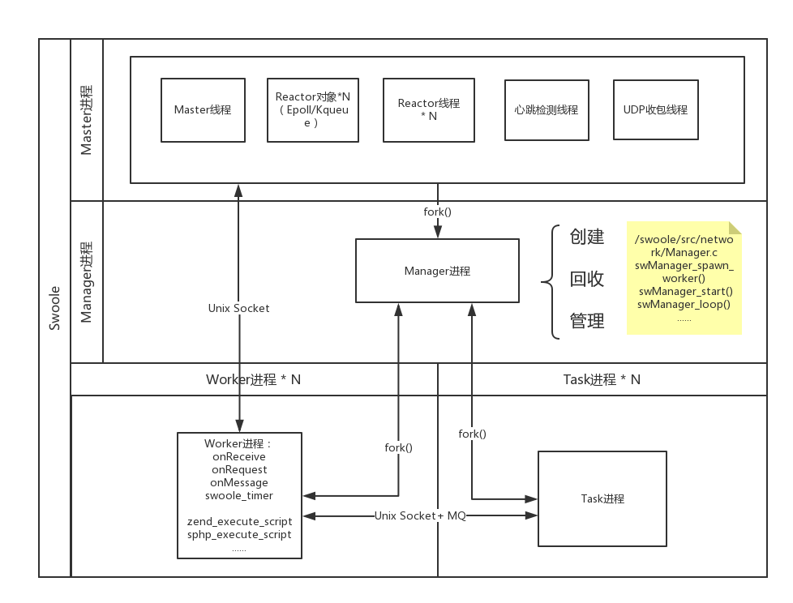

# 常用类

## server

创建一个异步服务器程序，支持TCP、UDP、UnixSocket 3种协议，支持IPv4和IPv6，支持SSL/TLS单向双向证书的隧道加密。

类：Swoole\Server

运行流程图 ：

进程/线程结构图：

4类进程

- master进程（多线程，Reactor 线程模型）
- manager进程
- worker进程
- task进程

Swoole采用固定Worker进程的模式

- 全异步非阻塞服务器 worker_num配置为CPU核数的1-4倍即可。
- 同步阻塞服务器，worker_num配置为100或者更高，具体要看每次请求处理的耗时和操作系统负载状况

在Process模式下，来自客户端的TCP连接是在Master进程内维持的，worker进程的重启和异常退出，不会影响连接本身。

Server->getClientList : 用来遍历当前Server所有的客户端连接，Server::getClientList方法是基于共享内存的，不存在IOWait，遍历的速度很快。另外getClientList会返回所有TCP连接，而不仅仅是当前Worker进程的TCP连接。

Server->task
此功能用于将慢速的任务异步地去执行，比如一个聊天室服务器，可以用它来进行发送广播。
task底层使用Unix Socket管道通信，是全内存的，没有IO消耗

Task进程是同步阻塞的

Swoole使用Unix Socket实现进程间通信

### 事件

Swoole\Server是事件驱动模式，所有的业务逻辑代码必须写在事件回调函数中。当特定的网络事件发生后，底层会主动回调指定的PHP函数。

事件执行顺序

- 所有事件回调均在$server->start后发生
- 服务器关闭程序终止时最后一次事件是onShutdown
- 服务器启动成功后，onStart/onManagerStart/onWorkerStart会在不同的进程内并发执行
- onReceive/onConnect/onClose在Worker进程中触发
- Worker/Task进程启动/结束时会分别调用一次onWorkerStart/onWorkerStop
- onTask事件仅在task进程中发生
- onFinish事件仅在worker进程中发生

Swoole2/4版本支持了协程，使用协程后事件回调函数将会并发地执行。协程是一种用户态线程实现，没有额外的调度消耗，仅占用内存。

#### onStart事件

启动后在**主进程（master）**的主线程回调此函数

在此事件之前Server已进行了如下操作

- 已创建了manager进程
- 已创建了worker子进程
- 已监听所有TCP/UDP/UnixSocket端口，但未开始Accept连接和请求
- 已监听了定时器

接下来要执行

- 主Reactor开始接收事件，客户端可以connect到Server

#### onShutdown事件

此事件在Server正常结束时发生，（在主进程中执行回调函数？）

在此之前Swoole\Server已进行了如下操作

- 已关闭所有Reactor线程、HeartbeatCheck线程、UdpRecv线程
- 已关闭所有Worker进程、Task进程、User进程
- 已close所有TCP/UDP/UnixSocket监听端口
- 已关闭主Reactor

#### onWorkerStart事件

此事件在Worker进程/Task进程启动时发生

- onWorkerStart/onStart是并发执行的，没有先后顺序
- 可以通过$server->taskworker属性来判断当前是Worker进程还是Task进程
- 设置了worker_num和task_worker_num超过1时，每个进程都会触发一次onWorkerStart事件，可通过判断$worker_id区分不同的工作进程
- 由 worker 进程向 task 进程发送任务，task 进程处理完全部任务之后通过onFinish回调函数通知 worker 进程。例如，我们在后台操作向十万个用户群发通知邮件，操作完成后操作的状态显示为发送中，这时我们可以继续其他操作。等邮件群发完毕后，操作的状态自动改为已发送。

如果想使用Reload机制实现代码重载入，必须在onWorkerStart中require你的业务文件，而不是在文件头部。在onWorkerStart调用之前已包含的文件，不会重新载入代码。onWorkerStart之后的代码每个进程都需要在内存中保存一份

#### onConnect事件

有新的连接进入时，在worker进程中回调。

onConnect/onClose这2个回调发生在worker进程内，而不是主进程。（但连接是在主进程中管理的？）

连接进入后首先从主进程Accept，然后通知到Worker进程。之后才会将socket加入事件循环，监听可写。所以当收到的数据到达之前，Worker进程一定会先收到onConnect指令。（onConnect/onClose/onReceive 事件都是由reactor线程发出的）

#### onReceive事件

接收到数据时回调此函数，发生在worker进程中

#### onClose事件

TCP客户端连接关闭后，在worker进程中回调此函数。

连接的关闭过程比较复杂。在swoole中close操作是在onClose事件回调函数执行完，并通知到reactor线程后。才会真正执行。

- 客户端主动关闭
  - 这时reactor线程最先得到关闭的事件，之后会将此socket从事件循环中移除，并标记连接为removed，然后向Worker进程发送通知。当Worker进程得到通知后会回调onClose（如果有设置），然后再向reactor发送关闭确认。Reactor线程收到Worker进程的关闭确认后才会执行socket的清理工作，并close，将fd释放给操作系统。（客户端主动关闭连接后，TCP通道已不可用，所以收到Worker的发送指令，会将此数据丢弃。）
- 服务器主动关闭
  - 首先执行onClose事件回调，然后将连接标记为closed，并向reactor线程发送关闭确认。reactor线程收到此消息后会真正执行close。reactor会先收到发送数据的指令，再收到关闭确认指令。等待所有数据发送到客户端后，才会执行close操作。（服务器主动关闭连接后，即使客户端仍然向Server发送数据，达到服务器时也会被丢弃。）

#### onTask事件

在task_worker进程内被调用。
当前的Task进程在调用onTask回调函数时会将进程状态切换为忙碌，这时将不再接收新的Task，当onTask函数返回时会将进程状态切换为空闲然后继续接收新的Task。

#### onFinish事件

当worker进程投递的任务在task_worker中完成时，task进程会通过swoole_server->finish()方法将任务处理的结果发送给worker进程。（在worker进程中调用）

task进程的onTask事件中没有调用finish方法或者return结果，worker进程不会触发onFinish
执行onFinish逻辑的worker进程与下发task任务的worker进程是同一个进程

#### onManagerStart事件

当管理进程启动时调用它

onManagerStart触发时，说明：

- Task和Worker进程已创建
- Master进程状态不明，因为Manager与Master是并行的，onManagerStart回调发生是不能确定Master进程是否已就绪

### Worker 与 Master 进程如何通信

投递任务模式，Swoole提供了5种dispatch方式。通过Server::set方法设置dispatch_mode来配置（注意是对数据包的分配模式，即对每个请求的分配模式）

- 轮询模式（dispatch_mode = 1 ）：收到的请求数据包会轮询发到每个Worker进程。
- FD取模（dispatch_mode = 2）：数据包根据fd的值%worker_num来分配，这个模式可以保证一个TCP客户端连接发送的数据总是会被分配给同一个worker进程。
- 忙闲分配（dispatch_mode = 3）：Reactor只会给空闲的Worker进程投递数据。
- IP 取模（dispatch_mode = 4）：如果客户端的连接不稳定，经常发生断线重连，fd的值不是固定的，使用IP进行取模分配可以解决此问题。同一个IP地址会被分配到同一个Worker进程。
- UID 取模（dispatch_mode = 5）：与fd或IP取模分配一致，dispatch_mode = 5 需要应用层调用bind方法设置一个UID
- Stream 模式 ： 使用类似于php-fpm的Unix Socket短连接方式通信，Worker进程会变成Leader-Follower模式，争抢任务。

### Server中对象的4层生命周期

- 程序全局期 ： 在Server->start之前就创建好的对象，我们称之为程序全局生命周期。这些变量在程序启动后就会一直存在，直到整个程序结束运行才会销毁。程序全局对象所占用的内存是Worker进程间共享的，不会额外占用内存。这部分内存会在写时分离（COW），在Worker进程内对这些对象进行写操作时，会自动从共享内存中分离，变为进程全局对象。
- 进程全局期 ： Server启动后会创建多个进程，每个Worker子进程处理的请求数超过max_request配置后，就会自动销毁。Worker进程启动后创建的对象（onWorkerStart中创建的对象），在这个子进程存活周期之内，是常驻内存的。onConnect/onReceive/onClose 中都可以去访问它。进程全局对象所占用的内存是在当前子进程内存堆的，并非共享内存。对此对象的修改仅在当前Worker进程中有效
- 会话期 ：会话期是在onConnect后创建，或者在第一次onReceive时创建，onClose时销毁。一个客户端连接进入后，创建的对象会常驻内存，直到此客户端离开才会销毁。（一个会话中可以有多个请求）
- 请求期 ： 请求期就是指一个完整的请求发来，也就是onReceive收到请求开始处理，直到返回结果发送response。这个周期所创建的对象，会在请求完成后销毁。请求期对象与普通PHP程序中的对象就是一样的。请求到来时创建，请求结束后销毁。

## Coroutine

使用Coroutine有什么好处 ： 应用层可使用完全同步的编程方式，底层自动实现异步IO。

Swoole可以为每一个请求创建对应的协程，根据IO的状态来合理的调度协程，这会带来了以下优势：

- 开发者可以无感知的用同步的代码编写方式达到异步IO的效果和性能，避免了传统异步回调所带来的离散的代码逻辑和陷入多层回调中导致代码无法维护
- 同时由于底层封装了协程，所以对比传统的PHP层协程框架，开发者不需要使用yield关键词来标识一个协程IO操作，所以不再需要对yield的语义进行深入理解以及对每一级的调用都修改为yield，这极大的提高了开发效率

使用Coroutine

- 基于Server、Http\Server、WebSocket\Server进行开发，底层在onRequet, onReceive, onConnect等事件回调之前自动创建一个协程，在回调函数中使用协程API
- 使用Coroutine::create或go方法创建协程，在创建的协程中使用协程API

- 在协程Server中需要使用协程版Client，可以实现全异步Server
- 其他程序中可以使用go关键词手工创建协程
- 同时Swoole提供了协程工具集：Swoole\Coroutine，提供了获取当前协程id，反射调用等能力。

类 ： Swoole\Coroutine

协程之间并没有实质上的持续父子关系, 协程之间是相互隔离, 独立运作的

### Coroutine::create

由于底层会优先执行子协程的代码，因此只有子协程挂起时，Coroutine::create才会返回，继续执行当前协程的代码

Swoole的协程是单线程模型，因此：

- 使用go创建的子协程会优先执行，子协程执行完毕或挂起时，将重新回到父协程向下执行代码
- **如果子协程挂起后，父协程退出，不影响子协程的执行**

协程需要创建单独的内存栈，程退出时会释放申请的stack内存。

### Coroutine::defer

defer用于资源的释放, 会在协程关闭之前(即协程函数执行完毕时)进行调用, 就算抛出了异常, 已注册的defer也会被执行.

它的调用顺序和go语言中的defer一样是逆序的（先进后出）, 也就是先注册defer的后执行, 在底层defer列表是一个stack, 先进后出. 

### Coroutine\Channel

通道，类似于go语言的chan，支持多生产者协程和多消费者协程。底层自动实现了协程的切换和调度。

- 通道已满
  - 自动yield当前协程，其他消费者协程pop消费数据后，通道可写，将重新resume当前协程
  - 多个生产者协程同时push时，底层自动进行排队，底层会按照顺序逐个resume这些生产者协程
- 通道为空
  - 自动唤醒其中一个消费者协程
  - 多个消费者协程同时pop时，底层自动进行排队，按照顺序逐个resume这些消费者协程

### Coroutine\Client

Coroutine\Client提供了TCP、UDP、UnixSocket传输协议的Socket客户端封装代码，使用时仅需new Swoole\Coroutine\Client即可

- Coroutine\Client底层实现协程调度，业务层无需感知
- 使用方法和Client同步模式方法完全一致
- connect超时设置同时作用于Connect和Recv、Send 超时
- 除了正常的调用外，Coroutine\Client还支持并行请求

### Coroutine\Server

创建协程TCP服务器。与Server模块不同之处，Coroutine\Server是完全协程化实现的服务器。因此可以：

- 动态创建销毁，在运行时可以动态监听端口，也可以动态关闭服务器
- 处理连接的过程是完全同步的，程序可以顺序处理Connect、Receive、Close事件

#### Coroutine\Server->handle

原型
function Coroutine\Server->handle(callable $fn);

- 服务器在Accept成功后，会自动创建协程并执行$fn
- $fn接受一个参数，类型为Swoole\Coroutine\Server\Connection
- $fn是在新的子协程空间内执行，因此在函数内无需再次创建协程

### 并发调用

现在支持并发请求的Client有：

- Swoole\Coroutine\Client
- Swoole\Coroutine\Redis
- Swoole\Coroutine\MySQL
- Swoole\Coroutine\Http\Client

通常，如果一个业务请求中需要做一次redis请求和一次mysql请求，那么网络IO会是这样子：
redis发包->redis收包->mysql发包->mysql收包
以上流程网络IO的时间就等于 redis网络IO时间 + mysql网络IO时间。

而对于协程版本的Client，网络IO可以是这样子：
redis发包->mysql发包->redis收包->mysql收包
以上流程网络IO的时间就接近于 MAX(redis网络IO时间, mysql网络IO时间)。

Swoole的协程在底层实现上是单线程的，因此同一时间只有一个协程在工作，协程的执行是串行的。这与线程不同，多个线程会被操作系统调度到多个CPU并行执行。

### 协程

协程执行流程遵循以下原则:

- 协程没有IO等待 正常执行PHP代码，不会产生执行流程切换
- 协程遇到IO等待 立即将控制权切，待IO完成后，重新将执行流切回原来协程切出的点
- 协程并行协程依次执行，同上一个逻辑
- 协程嵌套执行流程由外向内逐层进入，直到发生IO，然后切到外层协程，父协程不会等待子协程结束